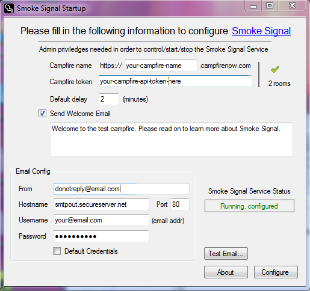

# **Smoke Signal Tutorial** #

## **Genesis** ##
[Campfire](http://www.campfirenow.com) (by 37Signals) is a wonderful group chat application. But if you’re not sitting in the campfire rooms all the time it's easy to miss out. My employer at the time didn't have Hack Days, so one weekend back in 2011 I sat down to come up with a solution.

This was a weekend project. Just a couple additions and bug fixes made since then.

----------

## **Basic UX** ##

The basic idea is you can get someone’s attention by sending them a “smoke signal” from any campfire room. Initiating a Smoke Signal queues up an email targeting that person. If they respond in campfire in a timely fashion (i.e. enter the campfire room and/or start chatting in that room) the queued email is canceled. Otherwise the email is sent notifying the person that their presence is being requested. The notification emails look something like this:

>Sent: Friday, January 07, 2011 4:45 PM
 
>To: Peter Potrebic
 
>Subject: Smoke Signal - room "Tech Lounge", from John Franklin

>https://yourcompany.campfirenow.com/room/436789
>When will you be able to finish that document, @Peter?
>
>Sincerely,
 
>Smoke Signal

**@ Syntax**
 
To send someone a smoke signal you use the “_@Name_” syntax anywhere in a campfire message. The "Name" must uniquely identify the person and must be at least 3 characters long. It is composed of either "initials" or complete names (first or last). So if my campfire name is Peter Potrebic the following all work:

>@Peter, @PeterP, @Potrebic, @PPotrebic, @PeterPotrebic

Note, if there's another "Peter", say Peter Smith, then @Peter won't work for either person. But @PeterP and @PeterS will.

**Multiple Smoke Signals**
 
You can send multiple smoke signals simply by repeating the callout syntax as in:
 > @Frank, @Joe when will the switch over to the new servers be complete?

**! Syntax**
 
If you know someone isn't paying attention you can use the “_!Name_” syntax and an email will be sent immediately. For example:
 > The chickens are hatching, !Sally please come quickly.

----------

## **User Settings** ##
By default a person has 2 minutes to respond before the Smoke Signal email is sent. And by default your campfire email address is used for Smoke Signals.

To avoid having to create a separate UI, one configures these options directly in campfire. Simply type 

> @SmokeSignal:Help” 

in any campfire room and you’ll be sent an email explaining how this works. The 2 settings are:

- Delay: Number of minutes before a smoke signal targeted to you is sent.
- AltEmail: The email to which Smoke Signal are sent.

Examples:

> @SSignal:Delay=4
 
> @Smoke:Altemail=4895551212@txt.att.net
 
> @Smoke:Altemail=

This last command will reset your Smoke Signal email to your campfire email address.

Whenever you tweak a setting a confirmation email will be sent to your campfire email address.

Smoke Signal is case insensitive.

----------

## **Installing Smoke Signal** ##
Smoke Signal runs as a Windows Services. It is installed once for the entire campire. So only a single person, typically the person that administers your campfire, would install Smoke Signal.

The Smoke Signal Service then uses the Campfire APIs to monitor activity and implement all the functionality described above.

One-time configuration is handled through a little "setup" application like so:

After the initial setup there is zero maintenance. Smoke Signal adapts to changing rooms and users, automatically reconfiguring itself as needed. It also sends an introductory email/tutorial to new members of your campfire.

In order for Email to work your smtp config needs to support relays. The Setup app has a “test” button so you can double check any configuration. It’s all pretty simple, so it should be self explanatory. Since this setup app is controlling an installed Windows Service is must run with elevated privileges.

Please send any questions or feedback on Smoke Signal to Potrebic “@” nodoto “.” com.

